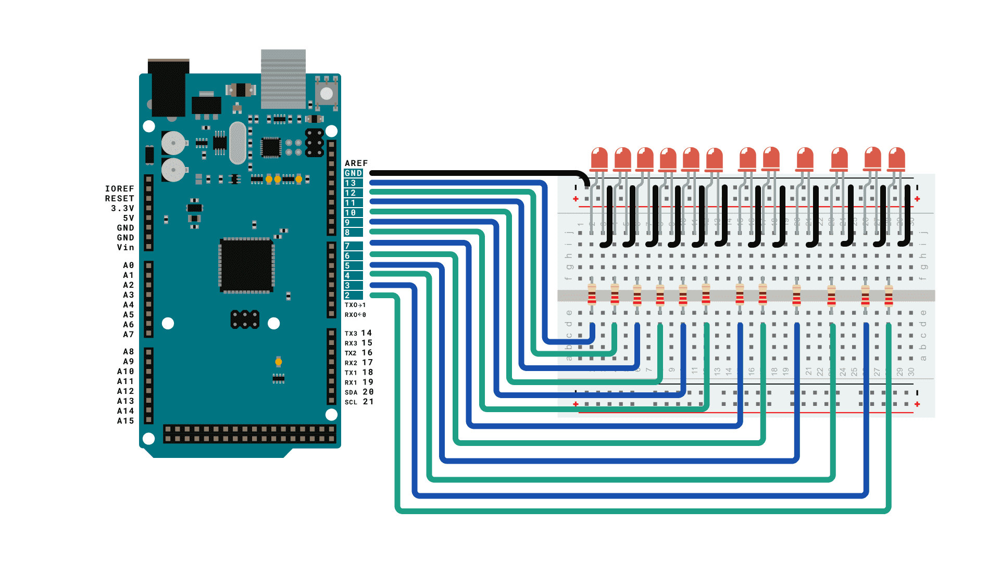

# Simple Arduino 10 random LED blinker

This is a simple Arduino project to blink 10 LEDs randomly within 0'5 and 3 seconds each. 

Made for backlight halloween decorations in 2023.

# Tools List
- Arduino MEGA 2560
- 10 LEDs
- 10 220k resistors
- 9v battery (optional)

# Diagram

